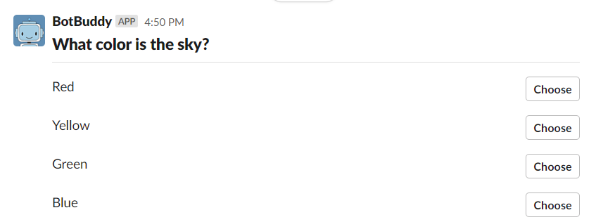

# Deployment Milestone
### Deployment scripts
We used DigitalOcean to depoly our bot. We did this by linking our repo to a DigitalOcean app which is setup as a webservice. We then input our environmental variables into DigitalOcean and had it encrpty them. It then generalted the [bot-buddy.yaml](bot-buddy.yaml) file which contains all of the setting for the deployment. DigitalOcean then ran the `node indes.js` command which started up our code. You can see the successful sdeployment below.  
    
DigitalOcean then generated a [URL](https://bot-buddy-uuvkt.ondigitalocean.app/) that we could use to deploy our bot. We then input this URL into our Slack bot settings.    

### Acceptance tests
#### Join Slack workspace
  - Join our Slack workspace with this [link](https://join.slack.com/t/ssw-345/shared_invite/zt-q3vp0hxc-Vwy_wbLyyaXOMNCg7HZPFQ).
#### Test Case 1: Using `/createquestion`
  - Start by typing `/createquestion` in the #general channel message box and then press enter. This should pull up a modal that will allow you to enter a question.  
    
  - Fill in each of the required fields and then click submit.
  - Question will be saved in the database
  - BotBuddy should then send you a message saying **"[Question Title] saved!"**.
#### Test Case 2: Using `/postquestion [Question Title]`
  - Start by typing `/postquestion` followed by the question title in the #general channel message box and press enter. 
  - If the question title exists:
      - BotBuddy will send a message containing the question and answer choices with clickable buttons to all members of the channel.
      
  - If the question title does not exist:
      - BotBuddy will send a message privately to you saying **"No matching documents."**
  - If you do not type a question title:
      - BotBuddy will send a message privately to you lising all your saved questions, saying **"Your questions are: [Question Titles, separated by commas]"**
#### Test Case 3: Answering Questions That Have Been Posted
  - If there is a question posted in the #general channel, we can test that it works by clicking on the answer choices.
  - If you select the correct answer:
      - BotBuddy will send a message privately to you saying **":tada:YOU GOT IT RIGHT! GREAT JOB!:tada:"**
      - BotBuddy will send a congrats gif privately to you. 
      
  - If you select the incorrect answer:
      - BotBuddy will send a message privately to you containing a hint from the question, saying **"Try again! Here's a hint: [hint]"**
      
#### Test Case 4: Using `/editquestion [Question Title]`
  - Start by typing `/editquestion` followed by the question title in the #general channel message box and press enter.
  - If the question title exists:
      - A modal will appear with your question data already inputted.
      - Make any edits to the question.
      - Click "Submit"
      - Question will be updated in the database
      - BotBuddy will send a message privately to you saying **"Question Updated"**
  - If the question title does not exist:
      - BotBuddy will send a message privately to you saying **"No matching documents."**
  - If you do not type a question title:
      - BotBuddy will send a message privately to you lising all your saved questions, saying **"Your questions are: [Question Titles, separated by commas]"**
#### Test Case 5: Using `/deletequestion [Question Title]`
  - Start by typing `/deletequestion` followed by the question title in the #general channel message box and press enter.
  - If the question title exists:
      - BotBuddy will send a message asking to confirm deleting the question, saying **"Are you sure you want to delete [Question Title]?"**
      - If you select "Yes"
          - Question will be deleted from the database
          - BotBuddy will send a message **"Question deleted!"**
       - If you select "Cancel"
          - BotBuddy will send a message privately to you saying **"Have a good day!"**
  - If the question title does not exist:
      - BotBuddy will send a message privately to you saying **"No matching documents."**
  - If you do not type a question title:
      - BotBuddy will send a message privately to you lising all your saved questions, saying **"Your questions are: [Question Titles, separated by commas]"** 
#### Test Case 6: Using `/myquestions`
  - Start by typing `/myquestions` in the #general channel message box and then press enter.
  - If your user has questions saved:
      - BotBuddy will send a message privately to you lising all your saved questions, saying **"Your questions are: [Question Titles, separated by commas]"**
      
  - If your user has no questions saved: 
      - BotBuddy will send a message privately to you saying **"You don't have any saved questions."**
