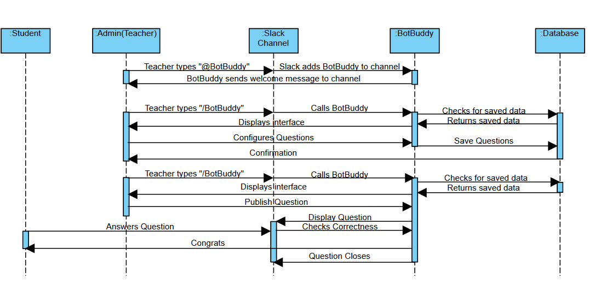
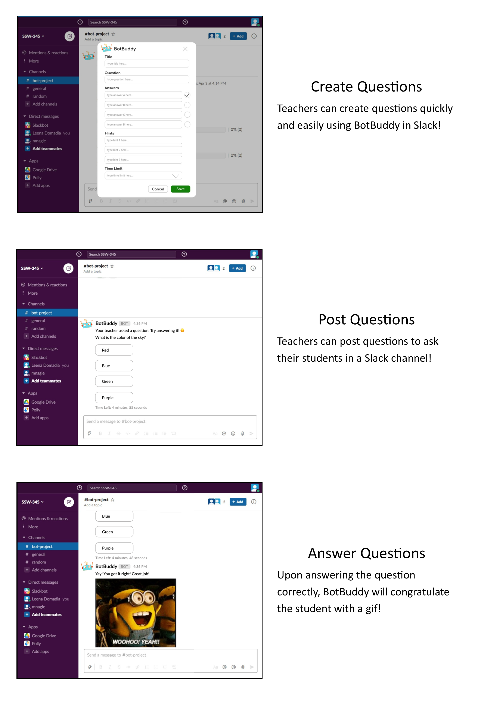
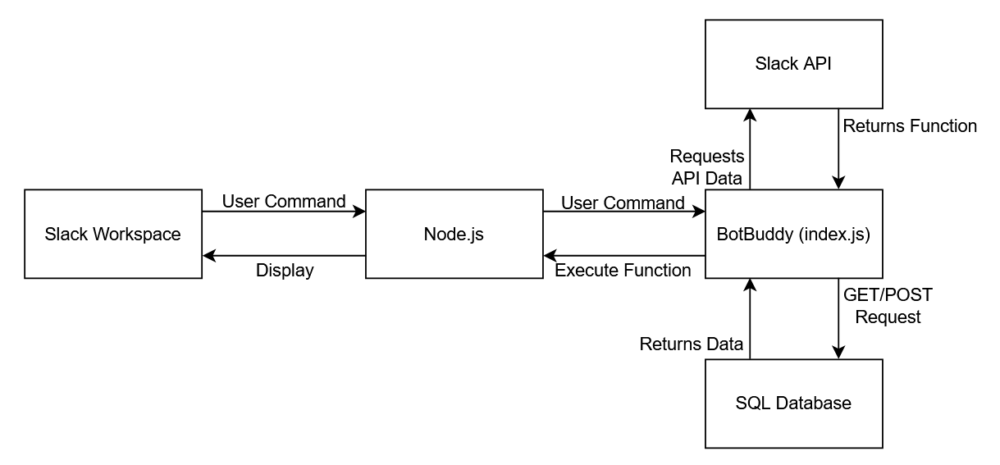

# Design Milestone
### Problem Statement
In the age of COVID-19, online learning has become the norm for students across the world. It was unexpected and schools were not readily prepared to teach young students online. Thus, students are struggling stay focused and connected to the learning material, as well as participating and interacting in class with their peers. Elementary school classrooms run heavily on student participation and interaction. This is something that is extremely difficult to acheive in a virtual school setting. And even after one year, this is a problem that continues to persists as many schools are still conducting classes remotely.
### Bot Description
Our bot, BotBuddy, is a reward bot that encourages young students to participate and engage in online learning. We will be implementing the bot through Slack. A teacher uses the bot to create questions with a particular command. The question can is a multiple choice question with one correct answer. BotBuddy will store and remember these questions in a database. During the lecture, the teacher can use a command to post the question, and BotBuddy will display the question on students' screens with interactive components that allows students to answer the question. If the student answers the question correctly, BotBuddy will celebrate with a fun gif. If the student gets the question wrong, BotBuddy will provide hints until the student answers the question correctly.
We believe the BotBuddy will be a fun and interactive way to get young students to stay engaged in online learning. Students feel very isolated and alone when sitting in front of a computer trying to pay attention. BotBuddy is a friendly sidekick that helps students feel less isolated. BotBuddy stays by the student's side like a friend would in class. Overall, it makes online learning more fun and exciting. Students will look forward to interacting with BotBuddy! 
### Use Cases
#### Use Case 1: A teacher creates a question
1. Preconditions
  * The teacher creates a slack channel with the students
  * The teacher adds BotBuddy to the slack channel
2. Main Flow
  * Teacher uses `/BotBuddy` command in the slack channel to call BotBuddy to create a question [S1]
  * Teacher inputs title, question, four answer choices, three hints, and time-limit
  * Teacher saves question to BotBuddy [S2]
3. Subflows
  * [S1] BotBuddy displays question interface window to the teacher
  * [S2] BotBuddy saves question to database
4. Alternate Flows
  * [E1] The teacher has not added BotBuddy to slack channel
  * [E2] The teacher has not filled in all the required inputs
  * [E3] The teacher uses command in their own DM
#### Use Case 2: A teacher posts a question
1. Preconditions
  * The teacher creates a slack channel with the students
  * The teacher adds BotBuddy to the slack channel
  * Database contains at least one question
2. Main Flow
  * Teacher uses `/BotBuddy` command in the slack channel to call BotBuddy to post a question [S1]
  * Time-limit expires
  * BotBuddy displays results in the slack channel
3. Subflows
  * [S1] BotBuddy displays the question in the slack channel visible to all students
4. Alternate Flows
  * [E1] The teacher has not created a question using BotBuddy
#### Use Case 3: A student answers a question
1. Preconditions
  * Student must be a member of the slack channel with BotBuddy
  * Teacher has posted question to the slack channel
2. Main Flow
  * Student selects an answer choice [S1]
  * A gif only visible to the student will be displayed, congradulting student on selecting the correct answer choice [S2]
3. Subflows
  * [S1] BotBuddy verifies that correct answer is selected
  * [S2] BotBuddy sends a gif visible only to the student
4. Alternate Flows
  * [E1] Student answers incorrectly; BotBuddy sends a hint
  * [E2] Time-limit expires; question closes and results are displayed
  
### Design Sketches
#### Sequence Flow

#### Storyboard

### Architecture Design
#### Diagram

After conducting research on how bots work in Slack, we were able to develop an architecture design for BotBuddy.
In our design, we first start in the Slack workspace, where users would use commands. From there, those commands will be send to Node.js which is running locally on our servers. The index.js file, where BotBuddy resides, will look at the command and call the appropriate function. Based off the function, calls will be made to the Slack API to send messages or questions to the user while the SQL Database will store questions that were created.
