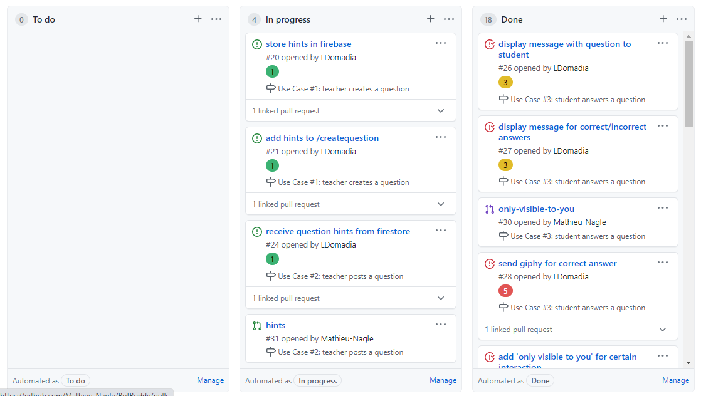
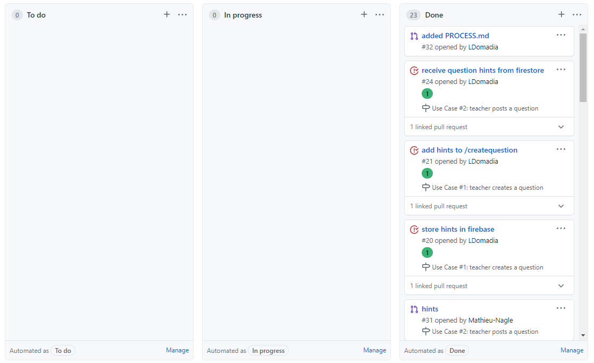
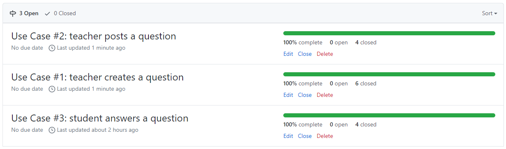

# Process Milestone
### Process
Our development process was fairly simple given that we only have two developers in our group. This made communication and development much easier. 

For the first iteration, we met once a week on Zoom to discuss the inital setup of BotBuddy on Slack and planning how to implement the use cases of our bot. Many hours in this iteration was spent on research on our to setup our bot, different frameworks to use, and exploring the Slack API. However, we initally faced a few challenges in setting up our bot because many articles and tutorials provide an outdated method of implementing a Slack Bot. We eventually settled on using Bolt for JavaScript as the framework for creating our bot. Bolt made creating slash commands, opening modals, and posting messages to a Slack channel. We end up using Firebase instead of SQL to store questions users create on BotBuddy. Firebase is easier to use because it is web-based and we have more experience using it.

For the second iteration, we met three times a week on Zoom to implement the use cases of BotBuddy. Since there is only two of us, we used the "pair programming" method to develop our bot. One of us would share our screens and develop the code while the other helps by looking into the Slack API and Bolt API for implementation processes. We would alternate sharing screens after each hour. By the end of the iteration, we were able to every main, sub, and alternate flow of our use cases except for implementing a time-limit and display results. We are currently on the fence of whether we want to include these features of BotBuddy. Our initial focus of BotBuddy is for students to feel engaged and motivated in online learning. To implement a time limit and displaying the results to the channel may discourage students to answer questions because it would feel more like academic than enjoyable. Our decision is not final and we are considering how we can use these features without losing focus of our original intention of our bot. 

Because there was only two of us, we felt that there was no need to take meeting notes. We were able to work very well with each other and we were able to divide the work evenly.
### Practices
In order to keep track of our progress during our two iterations, we implemented a project board on GitHub titled "BotBuddy". In our project board we have three columns: "to do", "in progress", "done". This is where we keep track of our issues and pull requests. For our issues, we created labels that represent the story points associated with them. 1 represents a simple implementation, 3 represents a moderate implementation, and 5 represents a complex implemention. Additionally, we created 3 milestones for our project based on the Use Cases. This made organization easier since we were able to assign issues to their specific use case. We didn't use the "assign" feature very often because it was only the two of us and majority of the issues and development was done together in pair programming.

Below is a screenshot of our project board towards the end of our second iteration. We have automation built into the project board for when new issues and pull requests are created and when pull requests are closed. 

Below is a screenshot of our project board at the end of the second iteration. We didn't take a screenshot of our first iteration, but we followed the same exact practices for the first and second iterations. 

Here is a screenshot of our milestones at the end of the second iteration. 
### Consistency
Because there are only two of us in our group, majority of the issues were completed together during Zoom meetings. We also didn't use the "assign" contributor feature to issues because of this reason. Here is the breakdown of the issues and the contributors:

* [BotBuddy setup on Slack](https://github.com/Mathieu-Nagle/BotBuddy/issues/9)
   * Contributors: Leena and Mathieu
* [create /createquestion command](https://github.com/Mathieu-Nagle/BotBuddy/issues/12)
   * Contributors: Leena
* [store question in database](https://github.com/Mathieu-Nagle/BotBuddy/issues/13)
   * Contributors: Leena and Mathieu
* [create /postquestion command](https://github.com/Mathieu-Nagle/BotBuddy/issues/14)
   * Contributors: Leena and Mathieu
* [receive question from database](https://github.com/Mathieu-Nagle/BotBuddy/issues/15)
   * Contributors: Leena and Mathieu
* [store hints in firebase](https://github.com/Mathieu-Nagle/BotBuddy/issues/20)
   * Contributors: Leena and Mathieu
* [add hints to /createquestion](https://github.com/Mathieu-Nagle/BotBuddy/issues/21)
   * Contributors: Leena and Mathieu
* [receive question hints from firestore](https://github.com/Mathieu-Nagle/BotBuddy/issues/24)
   * Contributors: Leena and Mathieu
* [display message with question to student](https://github.com/Mathieu-Nagle/BotBuddy/issues/26)
   * Contributors: Leena and Mathieu
* [display message for correct/incorrect answers](https://github.com/Mathieu-Nagle/BotBuddy/issues/27)
   * Contributors: Leena and Mathieu
* [send giphy for correct answer](https://github.com/Mathieu-Nagle/BotBuddy/issues/28)
   * Contributors: Mathieu
* [add 'only visible to you' for certain interaction](https://github.com/Mathieu-Nagle/BotBuddy/issues/29)
   * Contributors: Mathieu

### Grader Demo
We have already contacted our TA for the Grader Demo, and we are currently waiting for a response back to schedule the demo.
