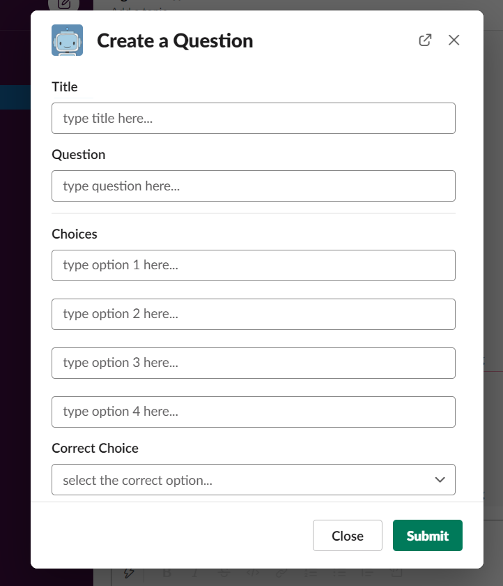
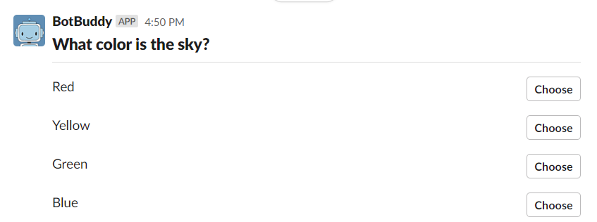
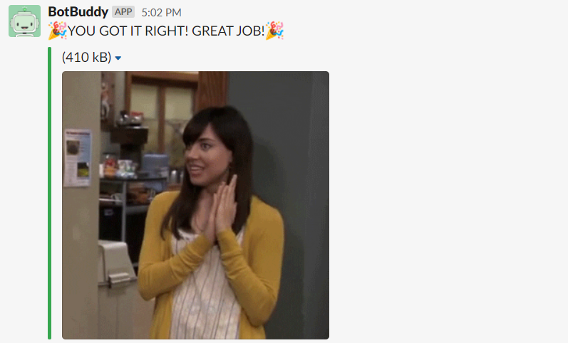

# Report Milestone

Presentation Video Link: [Click Here](https://www.youtube.com/watch?v=kFSv3MQi91Y)

## Problem Solved
Our original idea for BotBuddy was to create a bot to help students stay engaged in online learning, a problem they faced due to the COVID-19 pandemic. Because of the pandemic, in-person schools were suddenly shutdown and were not readily prepared to teach students virtually. Therefore, students lacked focus in the virtual classroom and were struggling in learning the material as well as interacting with their teachers and peers. BotBuddy was able to solve this problem by enouraging students to answer questions their teacher sends them with a fun and kid-friendly nature! When a student answers a question correctly, BotBuddy congrats the student and send them a congradutatory gif to celebrate! If answered incorrectly, BotBuddy helps the students by sending them a hint. BotBuddy interacts with the student when the teacher is unable to in the virtual classroom, which helps them stay focused, motivated, and entertained!

## Primary Features
The primary features of BotBuddy include Creating Questions, Posting Questions, and Answering Questions

### Creating Questions
A teacher can create a question using BotBuddy by entering the command `/createquestion`. This will open a windows that prompts the teacher to enter a question title, the question, the answer choices, the hints, and select which answer choice is correct. The image below shows the window the teacher will see. Once the teacher clicks "Submit", BotBuddy will save the question using database. 

### Posting Questions
A teacher can post a question they have created using BotBuddy by entering the command `/postquestion [Question Title]` and entering the question title they would like to post before clicking send. If the question title exists, BotBuddy will post the question to the channel with the question title and answer choices the student can select. The image below shows BotBuddy posting a question. If BotBuddy cannot find the question title in the database, BotBuddy will alert the teacher that it cannot find the question they requested. Additionally, if the teacher forgets to enter the question title when using the command, BotBuddy will send the teacher a list of questions that is saved.

### Answering Questions
Once BotBuddy posts a question in a channel, the students have the ability to answer the question! If they select the correct answer, BotBuddy will turn green, send them a congratulatory message, and send them a random gif. The image below shows a student answering the question correctly and how BotBuddy responds. However, if the student selects the incorrect answer, BotBuddy will turn red and will help the student by sending them a hint. 

### Additional Features
BotBuddy has additonal features including editing, deleting, and viewing questions that the teacher has saved. A teacher can edit a question using the `/editquestion [Question Title]` command. They can change any information about the question and click "Submit" to save their changes. A teacher can delete a question using the `/deletequestion [Question Title]` command. BotBuddy will ask the teacher to confirm the deletion before deleting the question. And finally, a teacher can view their saved questions using the command `/myquestions`. BotBuddy will send them a list of question that are saved.

## Reflection
Overall, we both extremely enjoyed working on this project. From working on this project, we were able to obtain and enhance many of our skill including learning how to develop and implement a Slack Bot, learning how to use development and collaboration tools on GitHub, and working together to achieve our goals. 

In terms of our development process, we were able to create an kanban board on GitHub to track progress and issues in our project. This was the first time we had ever using this development tool and we found it useful to stay organized in the duration of our project. Additionally, this gives us experience in using a kanban board that we can use in future work and in our careers. 

Looking back at our project, we are extremely happy that we were able to successfully implement our idea of BotBuddy. It gave us gradification when we were able to demonstate our bot with a few young kids. The kids really enjoyed BotBuddy's friendly nature and they had fun answering questions with him. This showed that our bot was a success and there is potential for BotBuddy's future!

Additional reflections can be found here:
- [Leena's Reflection](../reflection-leena/README.md)
- [Mathieu's Reflection](../reflection-mathieu/README.md)

## Future
For this project, we were able to successfully implement the major features of BotBuddy we originally had intended. As we were working on the project, we thought a few ideas to make BotBuddy more useful for teachers. Some of these ideas include adding a timer function where the student has to answer a question in a given timeframe and collecting student responses to a question for teachers to use to evaluate their performance. Currently, we have no set plan to work on these functions, but when given enough free time, we are willing to research these functions. Together, we really enjoyed working on this project and we would love to see BotBuddy develop and grow!
